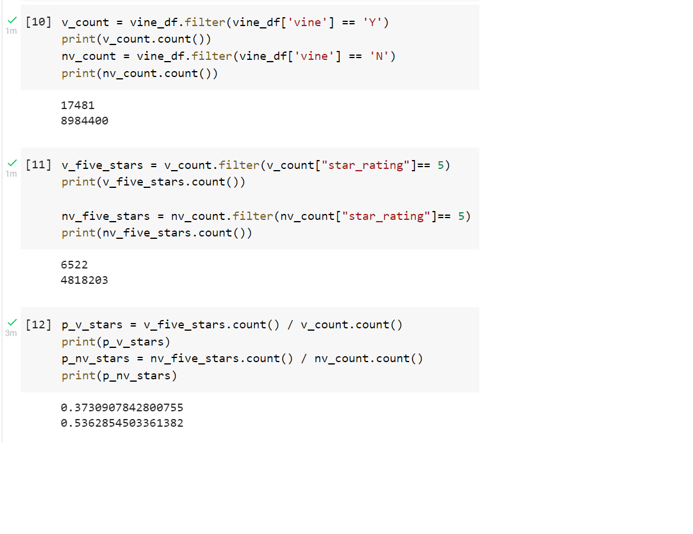

# Amazon_Vine_Analysis

## Amazon_Vine_Analysis Overview
  The purpose of this analysis was to analyze Amazon reviews written by members of the paid Amazon Vine program using a dataset and Pyspark to perform the ETL process and connet to an AWS RDS instance.

## Amazon_Vine_Analysis Results
  - There were 17,481 Vine reviews and 8,984,400 non Vine reviews in this analysis.
  - There were 6,522 5-star Vine reviews and 4,818,203 non Vine 5-star reviews.
  - 37% of the Vine reviews were 5-star and 53% of the non Vine reviews were 5-star.

## Amazon_Vine_Analysis Summary
  - Given the results of the analysis there is no positivity bias for Vine reviews compared to non Vine reviews. According to the analysis, 37% of the Vine reviews were 5-star compared to 53% of the non Vine reviews being 5-stars. An additonal analysis we could perform would be to determine the count of Vine reviews and non Vine reviews below 3 stars.
